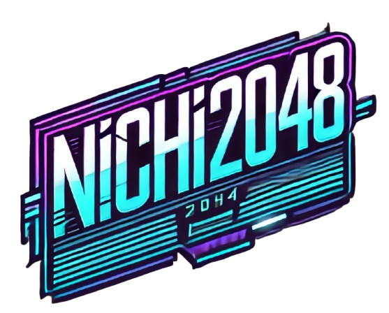
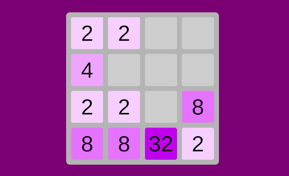
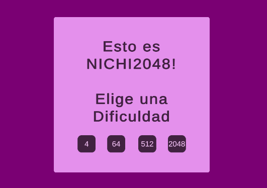

  

## **NICHI2048**

¡Bienvenido a NICHI2048, una reinterpretación fresca del clásico juego de puzzles 2048! En esta versión también podrás seleccionar tu nivel de dificultad al inicio de la partida.

  

## **Estructura del Proyecto**

El juego se construye sobre una base de componentes de Unity interconectados, organizados de la siguiente manera:

*   **Canvas Principal:** Contenedor de todos los elementos de la UI, incluyendo el menú de inicio, el tablero de juego (Grid), los paneles de Game Over y Game Win.

*   **Grid (Mapa de Fondo):** Representa el área de juego donde se desplazan las fichas.

*   **Tiles (Fichas):** Son las piezas numéricas que se combinan en el juego.

*   **Background (Fondo):** Representa el fondo.

## **Descripción del Código**

El código del juego se divide en los siguientes scripts:

*   **GameManager.cs:** (El Corazón del Juego)
    Este script controla el flujo general:

    *   Gestionar las pantallas de Game Start, Game Over y Game Win utilizando CanvasGroups.
    *   Permitir la selección de dificultad al inicio del juego.
    *   Iniciar un nuevo juego con la dificultad seleccionada.
    *   Detectar cuándo el juego termina (Game Over o Game Win) y mostrar la pantalla correspondiente.
    *   Funciones esenciales como `NewGame()`, `GameOver()`, `GameWin()` y `StartGameWithDifficulty()`.
    *   Utiliza `Time.timeScale` para pausar el juego durante la pantalla de inicio y la función `Fade` para animar la aparición y desaparición de los menús.

*   **TileBoard.cs:**
    Este script gestiona el tablero del juego, la creación de fichas, la lógica de movimiento y fusión, y la detección de Game Over y Game Win. Interactúa con el `GameManager` para informar sobre el estado del juego.

*   **TilesGrid.cs:**
    Representa la cuadrícula del tablero de juego. Proporciona métodos para acceder a las celdas y obtener celdas adyacentes.

*   **TilesRow.cs:**
    Representa una fila en la cuadrícula del tablero de juego.

*   **TilesCell.cs:**
    Representa una celda individual en la cuadrícula del tablero de juego.

*   **TileState.cs:**
    Define el estado visual de una ficha (color de fondo, color de texto, valor objetivo para Game Win).

*   **Tile.cs:**
    Controla el comportamiento individual de cada ficha, incluyendo su estado visual, movimiento y fusión.

## **Demostración del Juego**

[]

Aquí tienes una muestra en vídeo de mi juego, ¡disfrútala!
